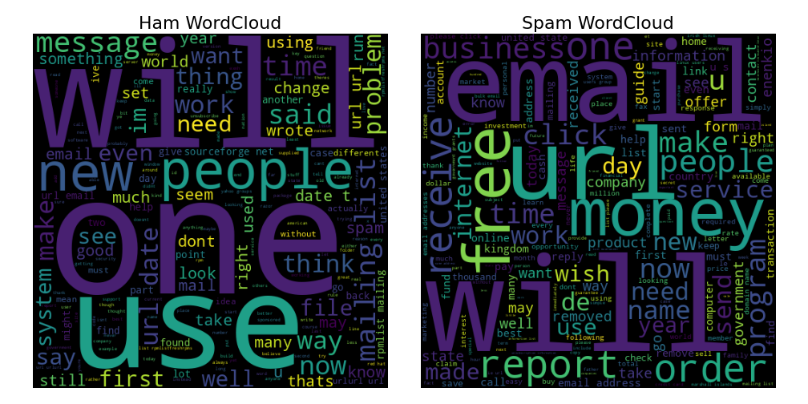

# spam

  

  

Esse projeto tem como objetivo classificar emails como legítimos (ham) ou falsos (spam). Temos então um problema de classificação binário supervisionado offline. Em particular, estamos trabalhando com um problema de linguagem natural (NLP).

A execução foi separada em duas etapas: **ETL** e **modelagem**. Na ETL, os dados foram obtidos via requisição, transformados em emails e categorias, e salvos em csv. Na modelagem os dados foram pré-processados, analisados e modelados com **machine learning** e **deep learning**.

Os resultados obtidos nos dados de teste com o melhor modelo (SVC) foram

### Métricas de teste

Acurácia   | **Precisão** | Recall
---------  | -------- | ------ |
99%      | 99%    | **96%** 

